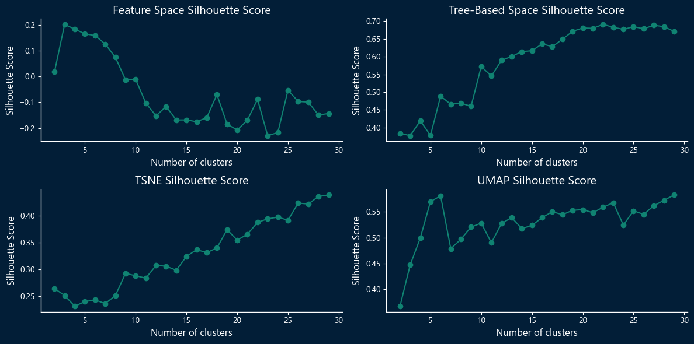
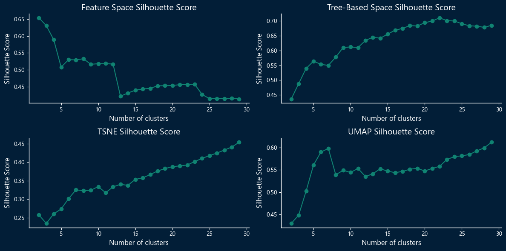

# Insiders Clustering

## The goal of this project is to discover customers' similarities to create an insiders program.

# Summary

* [1.0. Business Problem](#1-business-problem)
    * [1.1 Solution](#11-solution)
* [2.0. Bussiness Assumptions](#2-business-assumptions)
    * [2.1. Data Dictionary](#21-data-dictionary)

* [3.0. Solution Strategy](#3-solution-strategy)

* [4.0. Top 3 Data Insights](#4-top-3-data-insights)
* [5.0. Machine Learning Model Applied](#5-machine-learning-model-applied)
    * [5.1. Evaluation Metrics](#51-evaluation-metrics)
    * [5.2. Defining the number of clusters](#52-defining-the-number-of-clusters-and-the-embedding-space)
* [6.0. Machine Learning Model Performance](#6-machine-learning-model)
    * [6.1. Silhouette analysis plot](#61-silhouette-analysis-plot---final-model-k-means)
    * [6.2. Clusters in the Tree-based and UMAP space](#62-clusters-in-the-tree-based-and-umap-space)
* [7.0. Business Report](#7-business-report)
    * [7.1. Answering Business Questions](#71-answering-business-questions)
* [8.0. Model Deployment](#8-model-deployment)
* [9.0. Conclusions](#9-conclusions)
* [10.0. Lessons Learned](#10-lessons-learned)
* [11.0. References](#11-references)
  

# 1. Business Problem.

OnlineMart is an e-commerce that sells second-line products of multiple brands.

In over a year of operation, the marketing team realized that some customers in their base buy expensive products at high frequency and are responsible for a significant share of the company's revenue. To leverage this customer segment, the marketing has decided to introduce a loyalty program for these top customers, known as Insiders.

However, the marketing team doesn't have advanced data analysis knowledge to define the eligible customers for the program. So they reached out to the data team for assistance. 

The data team's task is to use advanced data mining techniques to identify and select the customers eligible for the Insiders program.

## 1.1 Solution

The final product will be a report with answers to the following business questions:

1. Who are the customers eligible for the insider cluster?
2. How many customers will be in the group?
3. What are the main attributes of the customers in the insider group?
4. What is the share of the revenue that comes from the Insider group?
5. What are the requirements for a customer to be eligible for the Insider group?
6. What guarantees that the Insider program is better than the rest of the database?
7. What can the marketing team do to augment the revenue?

# 2. Business Assumptions.

## 2.1 Data Dictionary

|Attribute|Description
----------|-----------
InvoiceNo| Invoice number. Nominal. A 6-digit integer number uniquely assigned to each transaction. If this code starts with the letter 'c', it indicates a cancellation.
StockCode| Product (item) code. Nominal. A 5-digit integer number uniquely assigned to each distinct product.
Description| Product (item) name. Nominal.
Quantity| The quantities of each product (item) per transaction. Numeric.
InvoiceDate| Invoice Date and time. The day and time when each transaction was generated.
UnitPrice| Unit price. Numeric, Product price per unit in sterling.
CustomerID| Customer number. Nominal. A 5-digit integer number uniquely assigned to each customer.
Country| Country name. Nominal. The name of the country where each customer resides.

Instances with negative quantity and price values that are not canceled purchases won't be considered for the project.

Instances with a stock code with letters are most likely not customer transactions.
  

# 3. Solution Strategy

CRISP-DM method was used to develop this project.

My strategy to solve this challenge was:

**Step 01. Data Description:**  Utilize descriptive statistics to gain an initial understanding of the dataset. Find inconsistencies like duplicates, missing values, incompatible data types, and strange values.

**Step 02. Data Filtering:** Remove instances that don't make sense for the project and inconsistencies found in the previous step.

**Step 03. Feature Engineering:** Create features from the customers' purchase history to allow us to create a dataset of unique customers with their purchase metrics. 

**Step 04. Exploratory Data Analysis:** Exploratory data analysis to find features to help segment the customers. Also, verify if there are any absurd values in the data.

**Step 05. Data Preparation:** Defining the encoding methods for categorical variables and scaling methods for numerical variables (use q-q plot and Kolmogorov-Smirnov test to help define which method to use).

**Step 06. Feature Selection:** Select the features that make more sense for the business to segment its customers.

**Step 07. Embedding Space Study:** Visualizing the data in a lower dimensional space using different dimensionality reduction techniques (PCA (Principal Component Analysis), TSNE (t-Dstributed Stochastic Neighbor), UMAP (Uniform Manifold Approximation and Projection), and a tree-based embedding space + UMAP). This can help reveal patterns, clusters, and relationships that may be challenging to perceive in higher dimensions.

**Step 08. Hyperparameter Fine Tunning:** Find the number of clusters for three models (K-means, Gaussian Mixture, and Hierarchical Clustering) using the silhouette score as the evaluation metric.

**Step 09. Machine Learning Modelling:** With the best and most reasonable number of clusters defined in the previous section, train the algorithm with the best performance to find the customers eligible for the Insiders program.

**Step 10. Exploratory Data Analysis:** Create a mind map of Hypotheses. Analyze the insider group, validate some hypotheses, and answer the business questions.

**Step 11. Deploy Model to Production:** Deploy the model to production using the AWS service.
  

# 4. Top 3 Data Insights

**Hypothesis 01:** The average total spent by the customers of the insider group is 50% higher than the average total spent by customers in other groups.

**True:** The Average total spent of the insider group is 1113.28% higher than the average of the other groups.
  

**Hypothesis 02:** The revenue generated by the insider group of customers represents 15% or more of the total revenue.

**True:** The insider group is responsible for 53.20% of the revenue.
  

**Hypothesis 03:** The insider group of customers has a purchase cancellation rate that is 5% lower than the overall cancellation rate.

**True/False.** The insider group cancellation rate is 41.78% lower than the overall cancellation rate.
  

# 5. Machine Learning Model Applied

In this project, three models were tested using four different spaces.

Models:

    - K-Means;
    - Gaussian Mixture Model;
    - Hierarchical Clustering.

Spaces (Embeddings):

- Feature Space;
- T - distributed stochastic neighbor embedding (T-SNE);
- Uniform Manifold Approximation and Projection for Dimension Reduction (UMAP);
- Tree-based space + UMAP.

## 5.1 Evaluation Metrics

The silhouette score was employed as the evaluation metric for assessing the performance of the models.

This metric quantifies the degree of separation and distinctiveness between clusters. Its values span from -1 to 1, indicating the extent to which clusters are well-separated and clearly distinguishable from one another.

This metric measures the cohesion of the data points within clusters and the separation between different clusters. Its values range from -1 to 1. 

1 -> The clusters are compact and well-separated.

0 -> The distance between clusters is not significant.

-1 -> Clusters are being assigned in the wrong way.
  

## 5.2 Defining the number of clusters and the Embedding space.

In this section, for each model, four plots were generated, each representing a different space, showing the silhouette score by the number of clusters.

### **5.2.1 K-Means**

  

### **5.2.2 Gaussian-Mixture**

  

### **5.2.3 Hierarchical Clustering**

  

# 6. Machine Learning Model

For the final model, the k-means algorithm was used in combination with the tree-based embedding and UMAP space. The number of clusters was 10 to capture meaningful customer segments and avoid an excessive number of groups that would be challenging to manage effectively.
  

## 6.1 Silhouette analysis plot - Final Model (K-means)

  

## 6.2 Clusters in the Tree-based and UMAP space

  

# 7. Business Report

## 7.1 Answering Business Questions

1. Who are the customers eligible for the insider cluster?

    

    Full List: [List of Customers](reports/table.MD)

2. How many customers will be in the group?

    The insider group will have 487 customers.

3. What are the main attributes of the customers in the insider group?

 

4. What is the share of the revenue that comes from the Insider group?

    The insider group is responsible for 53.20% of the revenue.

5. What are the requirements for a customer to be eligible for the Insider group?

    The model will decide who will be eligible for the insider group.

6. What guarantees that the Insider program is better than the rest of the database?

    The metrics of the insider group are better than other groups's metrics.

7. What can the marketing team do to augment the revenue?

1. Offer a direct line to the best customers, improving communication (announcing products/services and promoting sales).
2. Drop off unprofitable customers (customers who only buy the discounted line and avoid the premium range).
3. Personalized offers for each group.
4. Optimize marketing channels and identify the most effective marketing channels for each group.

# 8. Model Deployment

## Structure

1. Save the data on S3 on AWS.

2. Save UMAP and Tree transformers into S3.

3. Run the notebook (deploy) with cronjob and PaperMill on EC2 - AWS.

4. Save the results on the Postgres Database.

5. Access the data on Postgres with Power BI for the Dashboard. 

# 9. Conclusions

In this project, we have successfully developed a machine-learning model to identify customer clusters. The objective of this model is to assist the company define which customers should be eligible for their forthcoming loyalty program.

# 10. Lessons Learned

Clustering is a difficult task, and since there is no right or wrong answer it is to evaluate the performance of the algorithms.

In this project, I've learned about metrics to evaluate a clustering model.

In a clustering problem, we are interested in finding features that help us segregate our data. So that are a few statistics that we should focus on when analyzing the features of the data, like:

    - Range (difference between maximum and minimum value).
    - Interquartile Range (IQR).
    - Mean, Median, Standard Deviation, Coefficient of Variation.
    - The distribution of the variable (skewness, kurtosis).
 
Embedding and dimension reduction techniques can be used as a preprocessing step to boost the performance of some clustering models.

# 11. References

Comunidade DS

Introduction to Machine Learning with Python

Hands-on Machine Learning with Scikit Learn Keras and TensorFlow 

https://distill.pub/2016/misread-tsne/

## Author

#### This project was developed by Breno Teixeira Chaves.
