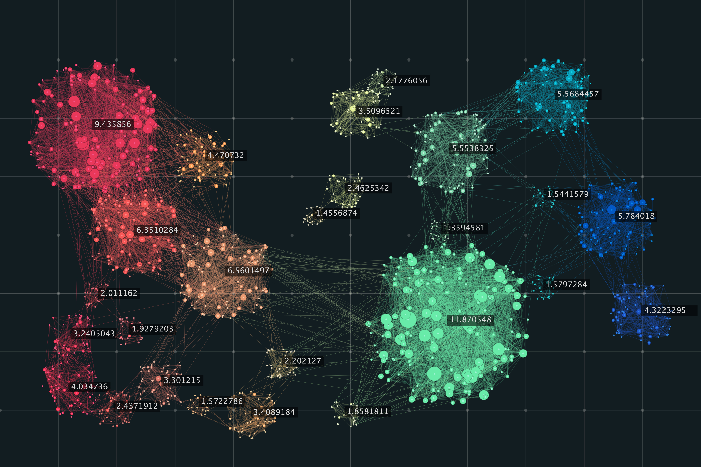
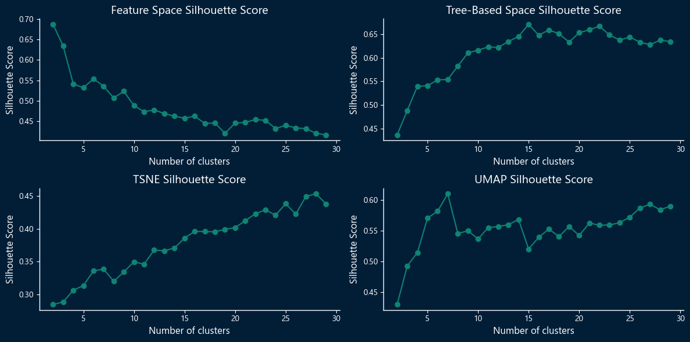
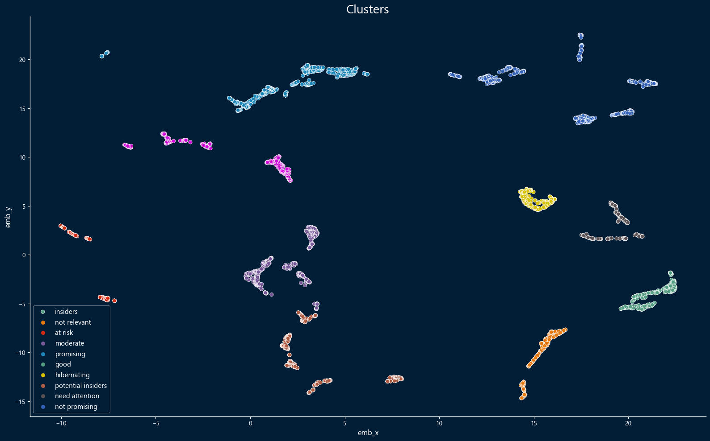

# Insiders - Agrupamento Clientes 

## O objetivo deste projeto é descobrir as similaridades entre os clientes para criar um programa de insiders.

# Sumário

* [1.0. Problema de Negócio](#1-problema-de-negócio)
    * [1.1 Solução](#11-solução)
* [2.0. Suposições de Negócio](#2-suposições-de-negócio)
    * [2.1. Dicionário de Dados](#21-dicionário-de-dados)
* [3.0. Estratégia da Solução](#3-estratégia-da-solução)
* [4.0. Principais Insights dos Dados](#4-principais-insights-dos-dados)
* [5.0. Modelo de Aprendizado de Máquina Aplicado](#5-modelo-de-aprendizado-de-máquina-aplicado)
    * [5.1. Métricas de Avaliação](#51-métricas-de-avaliação)
    * [5.2. Definindo o número de clusters e o espaço de incorporação](#52-definindo-o-número-de-clusters-e-o-espaço-de-incorporação)
* [6.0. Desempenho do Modelo de Aprendizado de Máquina](#6-modelo-de-aprendizado-de-máquina)
* [6.1. Gráfico de análise de silhueta - Modelo Final (K-means)](#61-gráfico-de-análise-de-silhueta---modelo-final-k-means)
* [6.2. Clusters no Espaço de Árvore e UMAP](#62-clusters-no-espaço-de-árvore-e-umap)
* [7.0. Relatório de Negócios](#7-relatório-de-negócios)
    * [7.1. Respondendo às Questões de Negócios](#71-respondendo-às-questões-de-negócios)
* [8.0. Implantação do Modelo](#8-implantação-do-modelo)
* [9.0. Conclusões](#9-conclusões)
* [10.0. Lições Aprendidas](#10-lições-aprendidas)
* [11.0. Referências](#11-referências)
  

# 1. Problema de Negócio.

O OnlineMart é um e-commerce que vende produtos de segunda linha de várias marcas.

Em mais de um ano de operação, a equipe de marketing percebeu que alguns clientes em sua base compram produtos caros com alta frequência e são responsáveis por uma parcela significativa da receita da empresa. Para alavancar esse segmento de clientes, a equipe de marketing decidiu introduzir um programa de fidelidade para esses principais clientes, conhecidos como Insiders.

No entanto, a equipe de marketing não possui conhecimento avançado de análise de dados para definir os clientes elegíveis para o programa. Então eles procuraram a equipe de dados para obter assistência.

A tarefa da equipe de dados é usar técnicas avançadas de mineração de dados para identificar e selecionar os clientes elegíveis para o programa Insiders.

## 1.1 Solução

O produto final será um relatório com respostas para as seguintes questões de negócio:

1. Quem são os clientes elegíveis para o grupo de insiders?
2. Quantos clientes estarão no grupo?
3. Quais são os principais atributos dos clientes no grupo de insiders?
4. Qual é a parcela da receita proveniente do grupo de Insiders?
5. Quais são os requisitos para um cliente ser elegível para o grupo de Insiders?
6. O que garante que o programa Insider é melhor do que o restante do banco de dados?
7. O que a equipe de marketing pode fazer para aumentar a receita?

## 2. Suposições de Negócio.

## 2.1 Dicionário de Dados

|Atributo|	Descrição
----------|-----------
InvoiceNo|	Número da fatura. Nominal. Um número inteiro de 6 dígitos atribuído de forma única a cada transação. Se este código começar com a letra 'c', indica uma cancelamento.
StockCode|	Código do produto (item). Nominal. Um número inteiro de 5 dígitos atribuído de forma única a cada produto distinto.
Description|	Nome do produto (item). Nominal.
Quantity|	As quantidades de cada produto (item) por transação. Numérico.
InvoiceDate|	Data e hora da fatura. O dia e a hora em que cada transação foi gerada.
UnitPrice|	Preço unitário. Numérico, preço do produto por unidade em libras.
CustomerID|	Número do cliente. Nominal. Um número inteiro de 5 dígitos atribuído de forma única a cada cliente.
Country|	Nome do país. Nominal. O nome do país onde cada cliente reside.

Instâncias com valores negativos de quantidade e preço que não são compras canceladas não serão consideradas para o projeto.

Instâncias com um código de estoque com letras provavelmente não são transações de clientes.
  

# 3. Estratégia da Solução

O método CRISP-DM foi utilizado para desenvolver este projeto.

Minha estratégia para resolver esse desafio foi:

**Passo 01.** Descrição dos Dados: Utilizar estatísticas descritivas para obter uma compreensão inicial do conjunto de dados. Encontrar inconsistências como duplicatas, valores ausentes, tipos de dados incompatíveis e valores estranhos.

**Passo 02.** Filtragem dos Dados: Remover instâncias que não fazem sentido para o projeto e inconsistências encontradas no passo anterior.

**Passo 03.** Engenharia de Feature: Criar atributos a partir do histórico de compras dos clientes para permitir a criação de um conjunto de dados de clientes únicos com suas métricas de compra.

**Passo 04.** Análise Exploratória de Dados: Análise exploratória de dados para encontrar recursos que ajudem a segmentar os clientes. Além disso, verificar se existem valores absurdos nos dados.

**Passo 05.** Preparação dos Dados: Definir os métodos de codificação para variáveis categóricas e métodos de escalonamento para variáveis numéricas (usar o gráfico q-q plot e o teste de Kolmogorov-Smirnov para ajudar a definir qual método usar).

**Passo 06.** Seleção de Recursos: Selecionar os recursos que fazem mais sentido para o negócio segmentar seus clientes.

**Passo 07.** Estudo do Espaço de Embedding: Visualização dos dados em um espaço de dimensionalidade inferior usando diferentes técnicas de redução de dimensionalidade (PCA (Principal Component Analysis), TSNE (t-Dstributed Stochastic Neighbor), UMAP (Uniform Manifold Approximation and Projection) e um espaço de incorporação baseado em árvore + UMAP). Isso pode ajudar a revelar padrões, clusters e relacionamentos que podem ser difíceis de perceber em dimensões mais altas.

**Passo 08.** Ajuste de Hiperparâmetros: Encontrar o número de clusters para três modelos (K-means, Mistura Gaussiana e Agrupamento Hierárquico) usando o score de silhueta como a métrica de avaliação.

**Passo 09.** Modelagem de Aprendizado de Máquina: Com o melhor e mais razoável número de clusters definido na seção anterior, treinar o algoritmo com o melhor desempenho para encontrar os clientes elegíveis para o programa Insiders.

**Passo 10.** Análise Exploratória de Dados: Criar um mapa mental de Hipóteses. Analisar o grupo de insiders, validar algumas hipóteses e responder às questões de negócios.

**Passo 11.** Implantação do Modelo em Produção: Implementar o modelo em produção usando o serviço AWS.
  

# 4. Principais Insights dos Dados

**Hipótese 01:** O total médio gasto pelos clientes do grupo de insiders é 50% maior do que o total médio gasto pelos clientes em outros grupos.

**Verdadeiro:** O total médio gasto do grupo de insiders é 1113,28% maior do que a média dos outros grupos.
  

**Hipótese 02:** A receita gerada pelo grupo de insiders representa 15% ou mais da receita total.

**Verdadeiro:** O grupo de insiders é responsável por 53,20% da receita.
  

**Hipótese 03:** O grupo de insiders de clientes tem uma taxa de cancelamento de compra que é 5% menor do que a taxa de cancelamento geral.

**Verdadeiro/Falso.** A taxa de cancelamento do grupo de insiders é 41,78% menor do que a taxa de cancelamento geral.
  

# 5. Modelo de Aprendizado de Máquina Aplicado
Neste projeto, três modelos foram testados usando quatro espaços de feature diferentes (Embedding).

Modelos:

- K-Means;
- Modelo de Mistura Gaussiana;
- Agrupamento Hierárquico.
Espaços (Incorporações):

- Espaço de Features;
- T - distributed stochastic neighbor embedding (T-SNE);
- Uniform Manifold Approximation and Projection for Dimension Reduction (UMAP);
- Tree-based space + UMAP.

## 5.1 Métricas de Avaliação

O score de silhueta foi empregado como a métrica de avaliação para avaliar o desempenho dos modelos.

Essa métrica quantifica o grau de separação e distinção entre clusters. Seus valores variam de -1 a 1, indicando o quanto os clusters estão bem separados e claramente distinguíveis entre si.

Essa métrica mede a coesão dos pontos de dados dentro dos clusters e a separação entre diferentes clusters. Seus valores variam de -1 a 1.

1 -> Os clusters são compactos e bem separados.

0 -> A distância entre os clusters não é significativa.

-1 -> Os clusters estão sendo atribuídos de maneira incorreta.
  

## 5.2 Definindo o número de clusters e o espaço de incorporação.

Nesta seção, para cada modelo, foram gerados quatro gráficos, cada um representando um espaço diferente, mostrando o escore de silhueta pelo número de clusters.

### 5.2.1 K-Means

  

### 5.2.2 Gaussian-Mixture

  

### 5.2.3 Hierarchical Clustering

  

# 6. Modelo de Aprendizado de Máquina

Para o modelo final, o algoritmo k-means foi usado em combinação com o tree-based embedding e UMAP. O número de clusters foram 10, para capturar segmentos significativos de clientes e evitar um número excessivo de grupos que seriam desafiadores de gerenciar efetivamente.
  

## 6.1 Gráfico de análise de silhueta - Modelo Final (K-means)

  

## 6.2 Clusters no  tree-based embedding e UMAP

  

# 7. Relatório de Negócios

##  7.1 Respondendo às Questões de Negócios

1. Quem são os clientes elegíveis para o grupo de insiders?

 

 Lista Completa: [List of Customers](reports/table.MD)

2. Quantos clientes estarão no grupo?

- O grupo de insiders terá 487 clientes.

3. Quais são os principais atributos dos clientes no grupo de insiders?

 

4. Qual é a parcela da receita proveniente do grupo de Insiders?

O grupo de insiders é responsável por 53,20% da receita.

5. Quais são os requisitos para um cliente ser elegível para o grupo de Insiders?

O modelo decidirá quem será elegível para o grupo de insiders.

6. O que garante que o programa Insider é melhor do que o restante do banco de dados?

As métricas do grupo de insiders são melhores do que as métricas de outros grupos.

7. O que a equipe de marketing pode fazer para aumentar a receita?

1. Oferecer uma linha direta para os melhores clientes, melhorando a comunicação (anunciando produtos/serviços e promovendo vendas).
2. Deixar de atender clientes não lucrativos (clientes que compram apenas a linha com desconto e evitam a faixa premium).
3. Ofertas personalizadas para cada grupo.
4. Otimizar os canais de marketing e identificar os canais de marketing mais eficazes para cada grupo.

# 8. Implantação do Modelo

## Estrutura

1. Salvar os dados no S3 na AWS.
2. Salvar os transformadores UMAP e Tree no S3.
3. Executar o notebook (implantar) com cronjob e PaperMill no EC2 - AWS.
4. Salvar os resultados no Banco de Dados Postgres.
5. Acessar os dados no Postgres com o Power BI para o Dashboard.

# 9. Conclusões

Neste projeto, um modelo de aprendizado de máquina foi desenvolvido com sucesso  para identificar clusters de clientes. O objetivo deste modelo é ajudar a empresa a definir quais clientes são elegíveis para seu próximo programa de fidelidade.

# 10. Lições Aprendidas

O agrupamento é uma tarefa difícil e, como não há uma resposta certa ou errada, é difívil avaliar o desempenho dos algoritmos.

Aprendi sobre métricas para avaliar um modelo de agrupamento.

Em um problema de agrupamento, estamos interessados em encontrar características que nos ajudem a segregar nossos dados. Portanto, existem algumas estatísticas nas quais devemos nos concentrar ao analisar as características dos dados, como:

- Amplitude (diferença entre o valor máximo e mínimo).
- Amplitude Interquartil (IQR).
- Média, Mediana, Desvio Padrão, Coeficiente de Variação.
- A distribuição da variável (assimetria, curtose).

Técnicas de incorporação e redução de dimensionalidade podem ser usadas como etapa de pré-processamento para melhorar o desempenho de alguns modelos de agrupamento.

# 11. Referências

Comunidade DS

Introdução à Aprendizado de Máquina com Python

Hands-on Machine Learning with Scikit Learn Keras and TensorFlow

https://distill.pub/2016/misread-tsne/

## Autor

#### Este projeto foi desenvolvido por Breno Teixeira Chaves.
